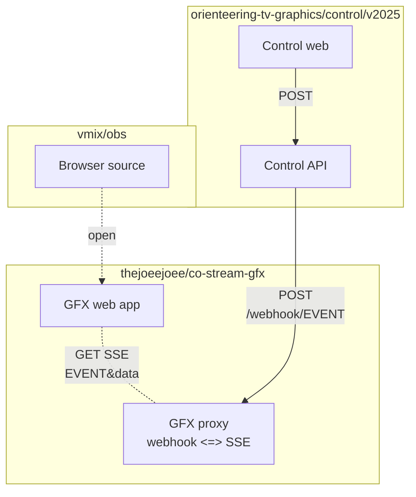

# ČO stream GFX

Livestream graphics for Český orienťák.

# Usage

```shell
yarn install
yarn run dev
```

Pass `?debug` to enable debug mode.


# Architecture



# Flag vs. Club Display

|                             | is_national | is_international (==!is_national) |
|-----------------------------|-------------|-----------------------------------|
| is_relay                    | club        | club+flag                         |
| is_individual (==!is_relay) | club        | flag                              |
