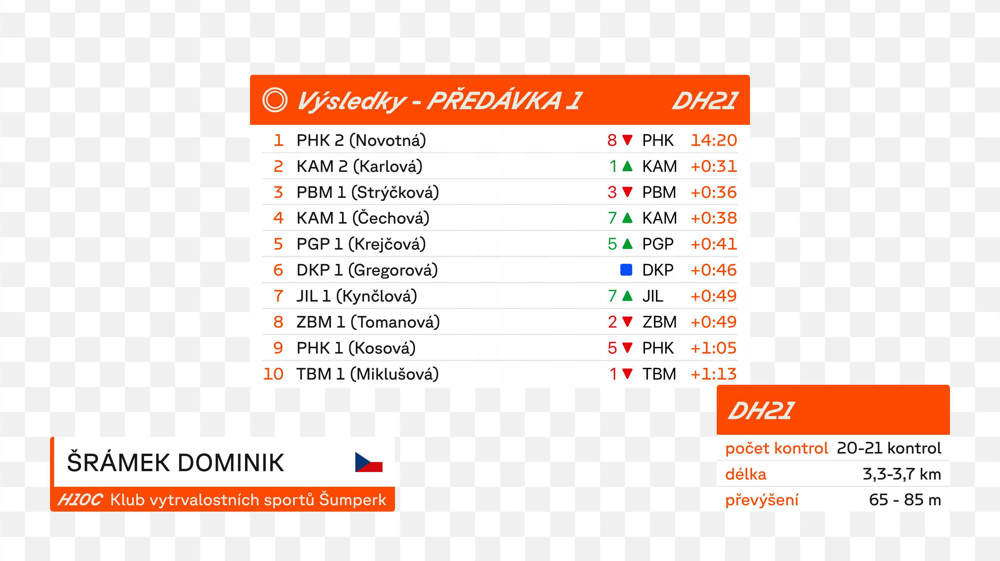

# ČO stream GFX

Livestream graphics for Český orienťák.

# Architecture


# GFX Proxy

For proxying webhook events from the control API to the GFX web app via Server-Sent Events (SSE), you've to run the proxy:

```shell
docker run -it --rm -p 8080:8080 docker.io/thejoeejoee/co-stream-gfx-proxy:latest
```

Afterward, webhook calls are expected to be sent to `http://IP:8080/*/EVENT`.

GFX web graphics takes `sse` GET parameter to specify the SSE endpoint (by default, `localhost:8080/_sse/default` is used):

```
https://thejoeejoee.github.io/co-stream-gfx/?sse=http://IP:8080/_sse/default
```

Single special call is to hide all graphics, which is done by calling the same API with `Function=OverlayInputAllOff`.


# Flag vs. Club Display

|                             | is_national | is_international (==!is_national) |
|-----------------------------|-------------|-----------------------------------|
| is_relay                    | club        | club+flag                         |
| is_individual (==!is_relay) | club        | flag                              |

# Examples





# App development

```shell
yarn install
yarn run dev
```

Pass `?debug` to enable debug mode with autoplay and examples.

